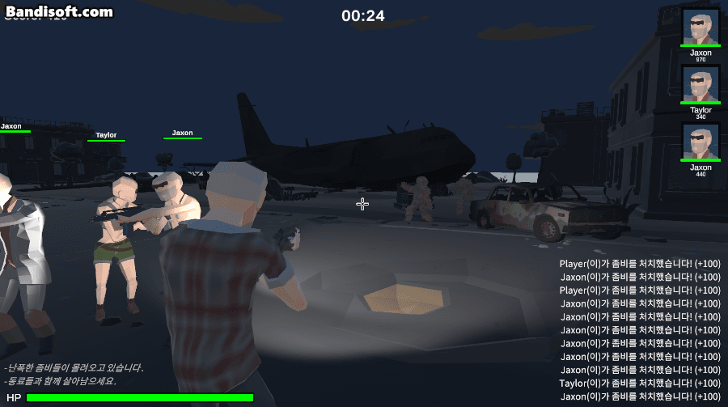

<div align="center">

# Right 4 Dead

### Unity Zombie First-Person Shooter

이동, 조준, 사격부터 좀비 AI와 전투 UI까지 구현한 1인 개발 FPS 프로젝트입니다.


<br>



</div>

## 프로젝트 개요

| 항목 | 내용 |
| --- | --- |
| 개발 기간 | 2024.04.06 ~ 2024.04.20 · 2주 |
| 개발 형태 | 기획 및 클라이언트 1인 개발 |
| 장르 | 좀비 FPS |
| 엔진 | Unity 2022.3.16f1 |
| 기술 | C#, Animation Rigging, Cinemachine, uGUI |
| 형상 관리 | Git, GitHub |

로우 폴리곤 캐릭터를 활용해 FPS 시점의 이동, 조준, 사격과 좀비 전투를 구현했습니다. 공통 캐릭터 코드를 상속해 플레이어, 봇과 좀비를 구성하고, 각 캐릭터에 필요한 입력·무기·감지·AI 컴포넌트를 조합했습니다.

## 주요 구현

### 전투 및 캐릭터

- FPS 시점의 이동, 조준, 사격과 재장전 시스템
- Animation Rigging의 IK를 이용한 조준 방향 애니메이션
- 이전 프레임과 현재 프레임 사이를 보간하는 고속 투사체 충돌 판정
- 플레이어 공격, 좀비 피격과 캐릭터 상태 처리

### AI

- Behavior Tree 방식을 모방한 봇·좀비 AI 구조
- 타깃 감지, 이동과 공격 행동
- 공통 캐릭터를 상속한 플레이어, 봇과 좀비 클래스

### 화면 및 시스템

- 점수, 체력, 전투 로그와 캐릭터 상태 UI
- Fade In/Out과 빈 씬을 이용한 씬 전환
- 투사체와 반복 오브젝트를 관리하는 Object Pool
- Cinemachine 기반 게임 카메라

## 구조

```text
Character                           # 캐릭터 공통 상태와 피격 처리
├─ PlayerCharacter                 # 플레이어 입력과 전투
└─ AICharacter                     # AI 캐릭터 공통 기능
   ├─ BotCharacter                 # 무장 봇
   └─ Zombie                       # 좀비

Weapon
└─ Gun
   └─ Assault                      # 연사 무기

Projectile
└─ DirectionalProjectile           # 이동 구간을 보간하는 투사체
```

플레이어 입력은 이동과 조준을 제어하고, 무기 코드는 사격과 재장전을 처리합니다. 봇과 좀비는 공통 AI 캐릭터 기능을 상속하며, 타깃 감지와 행동 처리는 개별 컴포넌트로 구성했습니다.

## 사용 에셋 및 패키지

- Cinemachine
- Unity Animation Rigging
- uGUI
- Polygon Battle Royale
- Mixamo Animation
